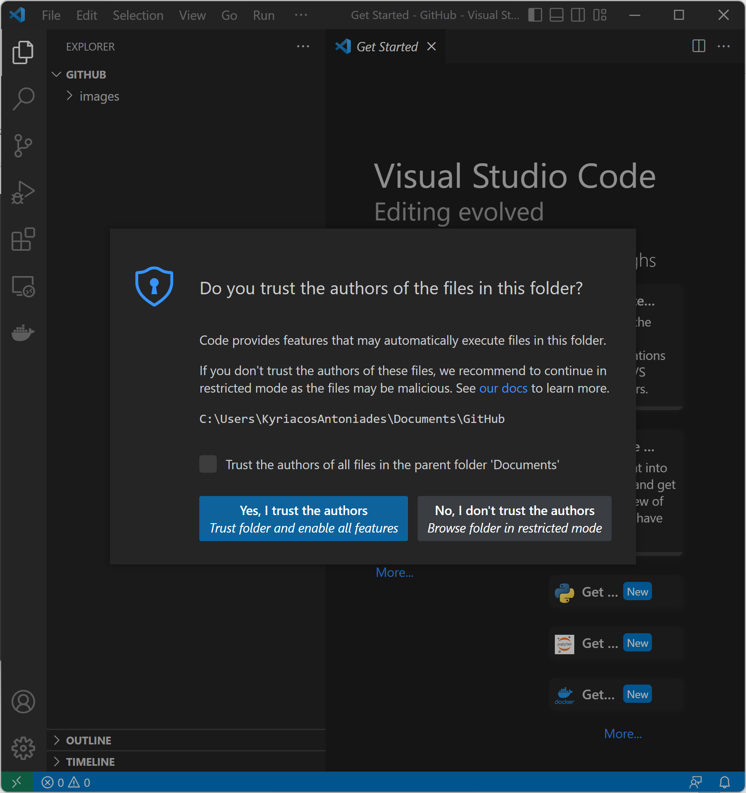
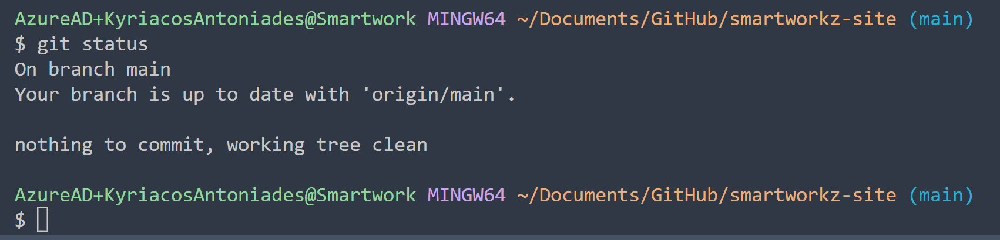
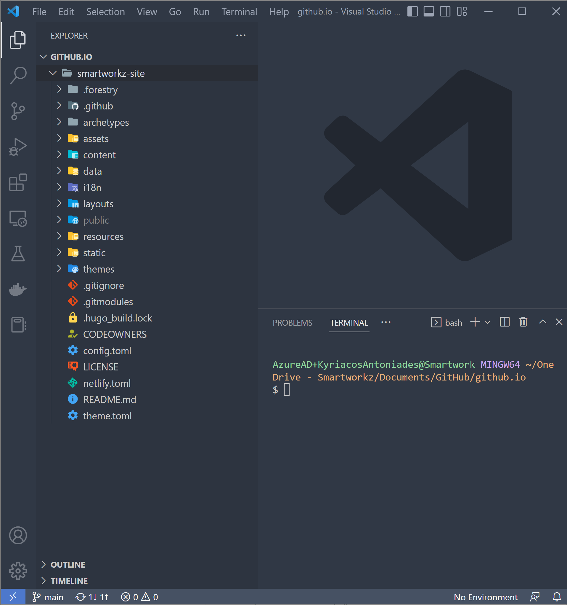

# Hugo on GitHub Pages with Forestry and Netlify


Smartworkz's static (web) site is based on the following integrations:

- [Hugo](https://gohugo.io/) a static site generator installed on your local machine for rapid static site design and development
- [Github](https://github.com/) to store backups
- [Forestry](https://forestry.io/) a static site CMS hosted service for daily content creation/editing
- [Netlify](https://www.netlify.com/) a static file hosting serviice to watch Github for any changes and build/deploy as needed

  

## Prerequisites

* If not already done, *Install [Hugo](https://gohugo.io/getting-started/installing/)*
* If not already done, *Install [Visual Studio Code](https://code.visualstudio.com/download) (VSC)*
* If not already done, *Install [Git Bash](https://git-scm.com/downloads)*
* *(Optional) Configure Git Bash as the default terminal for VSC*

  1. Click View, Terminal
  2. After the Terminal appears, press the F1 key
  3. Type the following, Terminal: Select Default Profile
  4. Select from the dropdown, Git Bash

## Hugo and GitHub Pages

* *Navifate to your local Git repository*

  
* `cmd` *in your File Explorer path and press the Enter key*

  

  The command window prompt opens:

  
* `code .` *in the prompt and press the Enter key*

  

  The Visual Studio Code (VSC) application opens
* *Trust the Authors and on the Menu click View and select Terminal*

  

  The Git Bash terminal appears:

  
* *Clone a Hugo Template of this site*

  This contains all the files used to generate the site, not the site itself. Later, will create another separate repository to host the static (web) site files

  

  `git clone https://github.com/smartworkz-kyriacos/smartworkz-site.git`

  Clones the repository in the local git repository path

  
* *`cd` into site*

  

  `cd smartworkz-site`
* *Check status*

  

  `git status`
* *Check directory structure*

  

  ```
  ls
  ls -la
  ```
* *Check smartworkz-site tree view*
* *Open and log in to your [GitHub account](https://github.com/)*
* *Create a GitHub repository for the generated static (web) site files*
  Let the repository itself to remain default as Public
  

  The name of this repository follows the format

  `<USERNAME>`.`github.io`

  Replace with your own `<USERNAME>`
* Return to the terminal and change to the local Git directory for your `<USERNAME>`.`github.io` hosting site `cmd` in and `code .` to open in VSC

  
* *Clone your previous GitHub tepository with Smartworkz's template containing all static (web) files in your  `<USERNAME>`.`github.io` local Git repository*

  `git clone https://github.com/smartworkz-kyriacos/smartworkz-site.git`

  
* *Check that the template site is functioning*

   `hugo server -D`

  This will set up the site locally and allow it to be viewed at the address specified in the shell (http://localhost:1313). Observe the `/public` folder created:

  
* *Generate the static files of the web site and push it to the `<USERNAME>.github.io` repository*

  1. Remove the `public` directory in case as it was created with Hugo previously

     `rm -rf public`
  2. Generate the actual website files in your site project directory in a subdirectory called `public/` with a submodule repository (**note:** *below is a one-line code*)

     `git submodule add -b main https://github.com/<USERNAME>/<USERNAME>.github.io.git public`

  Git submodules are  nested repositories. By making the `.github.io` repository a submodule of the `smartworkz-site` repository, we' re replicating the structure Hugo uses by making the rendered website files in a `/public/` subdirectory inside the site project directory `smartworkz-site` itself.
* *Deploy to `<USERNAME>`.`github.io` by running the following commands:*

  ```
  hugo
  cd public
  git add .
  git commit -m "write a commit message here to describe the changes"
  git push origin main
  ```
* *Automate deployment by creating a bash file `deploy.sh` file*

  ```
  #!/bin/sh

  # If a command fails then the deploy stops
  set -e

  printf "\033[0;32mDeploying updates to GitHub...\033[0m\n"

  # Build the project.
  hugo # if using a theme, replace with `hugo -t <YOURTHEME>`

  # Go To Public folder
  cd public

  # Add changes to git.
  git add .

  # Commit changes.
  msg="rebuilding site $(date)"
  if [ -n "$*" ]; then
  	msg="$*"
  fi
  git commit -m "$msg"

  # Push source and build repos.
  git push origin master
  ```
* *Run deployment by typing:*

  `./deploy.sh "write a commit message here to describe the changes you made"`

Changes should be live shortly at `https://<USERNAME>.github.io` (a hard refresh might be necessary). Future edits will only require this single line invoking the deploy script.

Push changes to the site project repository as well by using the `git add .`, `git commit -m "a commit message"`, and `git push origin master` commands in order. It is important to keep this repository up to date with local changes because these are the files from which the website repository is generated (they also contain any draft posts/pages). Should something happen to the files on your local computer, you will be able to `git pull` or `git clone` them again to recover them.

Changes will be live shortly at your  `https://<USERNAME>.github.io` with any changes everytime you deploy your GitHub Pages

## Hugo and Forestry Integration


[](https://app.netlify.com/sites/boring-heisenberg-e4c346/deploys)
