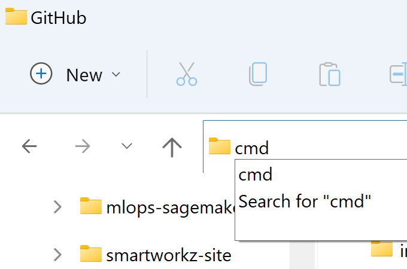

# Hugo on GitHub Pages with Forestry and Netlify


Smartworkz's static (web) site is based on the following integrations:

- [Hugo](https://gohugo.io/) a static site generator installed on your local machine for rapid static site design and development
- [Github](https://github.com/) to store backups
- [Forestry](https://forestry.io/) a static site CMS hosted service for daily content creation/editing
- [Netlify](https://www.netlify.com/) a static file hosting serviice to watch Github for any changes and build/deploy as needed

  

## Prerequisites

* If not already done, *Install [Hugo](https://gohugo.io/getting-started/installing/)*
* If not already done, *Install [Visual Studio Code](https://code.visualstudio.com/download) (VSC)*
* If not already done, *Install [Git Bash](https://git-scm.com/downloads)*
* *(Optional) Configure Git Bash as the default terminal for VSC*

  1. Click View, Terminal
  2. After the Terminal appears, press the F1 key
  3. Type the following, Terminal: Select Default Profile
  4. Select from the dropdown, Git Bash

## Getting started

* *Navifate to your local Git repository*

  
* `cmd` *in your File Explorer path and press the Enter key*

  

  The command window prompt opens:

  
* `code .` *in the prompt and press the Enter key*

  

  The Visual Studio Code (VSC) application opens
* *Trust the Authors and on the Menu click View and select Terminal*

  

  The Git Bash terminal appears:

  
* *Clone a Hugo Template of this site*

  This contains all the files used to generate the site, not the site itself. Later, will create another separate repository to host the static (web) site files

  

  `git clone https://github.com/smartworkz-kyriacos/smartworkz-site.git`

  Clones the repository in the local git repository path

  
* `cd` into site

  

  `cd smartworkz-site`
* Check status

  

  `git status`
* *Check directory structure*

  

  ```
  ls
  ls -la
  ```
* *Check smartworkz-site tree view*

  
* *Open and log in to your [GitHub account](https://github.com/)*
* *Create a GitHub repository for the generated static (web) site files*
  Let the repository itself to remain as default Public
  

  The name of this repository follows the format `<USERNAME>.github.io`
* 
* 
* 
* 

### Local hosting

To start, use the following command: hugo server This will set up the site locally and allow it to be viewed at the address specified in the shell (usually http://localhost:1313).


[](https://app.netlify.com/sites/boring-heisenberg-e4c346/deploys)
